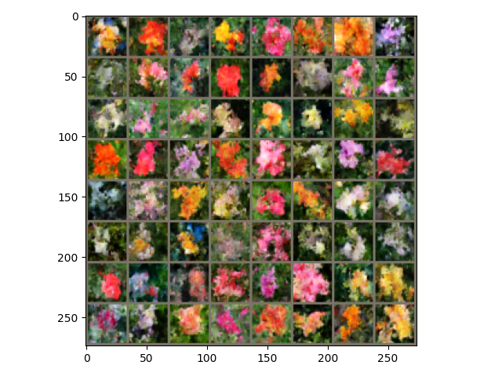
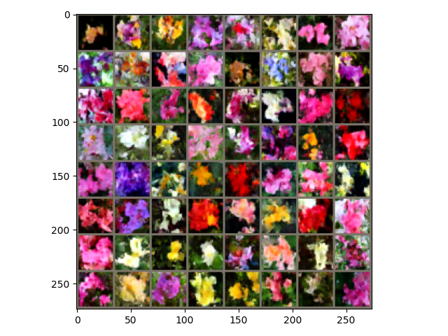
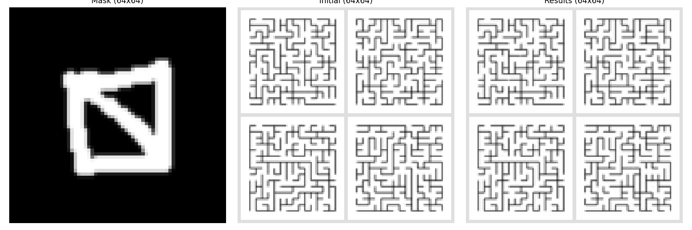
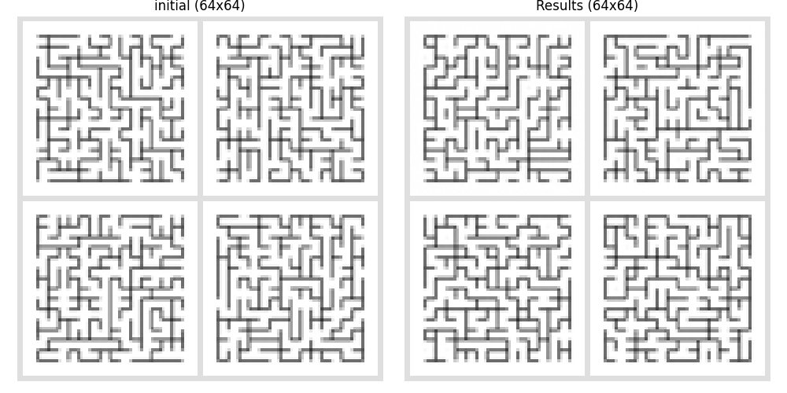

## Introduction

This repository contains the code and notebooks developed during my **research internship at INRIA Paris (ARGO team)** under the supervision of **Marc Lelarge**. The general objective of the internship was to explore, in a progressive and experimental manner, the **links between data assimilation** (for physical dynamical systems) and **generative diffusion models** (probabilistic diffusion, score-based, stochastic interpolants), and then to **evaluate their relevance on structured data** (images of Uniform Spanning Trees—UST—and **graphs**).

The work is organized into complementary stages:
1) **Data Assimilation**: Implementations of classical methods (BLUE, 3D-VAR) and demonstrations on toy systems (e.g., simple pendulum, Lorenz attractor) to establish the framework and metrics.
2) **Diffusion Models (DDPM)**: Practical application on images (MNIST, CIFAR-10) to acquire an operational foundation for denoising/generation and conditioning.
3) **Stochastic Interpolants (SDE/ODE)**: Experimentation with the unifying framework (flows/diffusions) of **Albergo & Vanden-Eijnden**—first in **2D** (controlled passage between two distributions), then on **visual data** (e.g., *Oxford Flowers*).
4) **Application to UST "Assimilation" via Images**: **Conditional inpainting** of Uniform Spanning Trees (UST) with **resampling** to improve the local coherence of the completed regions.
5) **Diffusion on Graphs (UST)**: Attempt at **discrete** generation on adjacency matrices (inspired by "discrete diffusion" approaches), with **topological constraints** (connectivity, acyclicity, number of edges) via the loss function and **post-processing** into USTs.

### What the repository contains (broad strokes)

- **Assimilation (BLUE, 3D-VAR)**: Educational and reproducible notebooks with visualizations of assimilated trajectories.
- **Diffusion (DDPM)**: Training/sampling notebook on images (MNIST / CIFAR-10 demos).
- **Stochastic Interpolants**: Two notebooks ( **2D** case and **images**) illustrating SDE/ODE and their associated solvers.
- **UST Inpainting (by image)**: Script for mask generation and **diffusion completion** (conditional inpainting with resampling).
- **Diffusion on Graphs (UST)**: Notebook for **discrete** diffusion on **adjacency matrices** (generation → constraints → post-processing into USTs).
- **Utility Data**: UST generation (Wilson's algorithm), test datasets, and visual outputs (subject to local availability).

## 1. Data Assimilation — `BLUE_3DVAR.ipynb`

This notebook introduces the **fundamental principles of data assimilation**, as used in the physical sciences (meteorology, oceanography, system dynamics).
The objective is to understand how to combine **forecasts from a model** and **noisy observations** to obtain an **optimal estimated state**.

### Content
- Presentation of **BLUE (Best Linear Unbiased Estimator)** and **3D-VAR** methods.
- Implementations on two reference physical systems:
  - a **simple pendulum**,
  - the **Lorenz system** (chaotic attractor).
- Visualization of assimilated trajectories compared to true trajectories and noisy observations.
- Illustration of the **role of covariance matrices** (background error *B* and observation error *R*) and the **optimal gain K**.

### Learning Objectives
- Understand the statistical foundations of data assimilation.
- Manipulate the update equations for the state and the Kalman gain.
- Acquire a general framework for integrating physical knowledge into learning models.

### Results
- The implementations show that the **BLUE** and **3D-VAR** algorithms effectively correct discrepancies between the model and the observations, bringing the estimated trajectories back towards the real dynamics.
- These exercises form the basis for subsequent work on **diffusion models applied to assimilation**.

---

## 2. Diffusion Models — `ddpm_nano_completed.ipynb`

This notebook provides a **practical introduction to generative diffusion models**, based on the founding paper by **Ho, Jain & Abbeel (2020)**:
> *Denoising Diffusion Probabilistic Models (DDPM)*, arXiv:2006.11239.

### Content
- Simplified implementation of a DDPM model ("nano version") in **PyTorch**.
- Application on the **MNIST** and **CIFAR-10** image datasets.
- Illustrated training and sampling steps:
  - *forward diffusion* (progressive addition of Gaussian noise),
  - *reverse denoising* (learned reverse process).
- Visualization of diffusion and denoising at different timesteps.
- Qualitative comparison with other generative models (e.g., GANs, VAEs).

### Objectives
- Assimilate the functioning of diffusion processes and their training stability.
- Understand the role of noise, variance, and **noise prediction (ε-prediction)**.
- Prepare for subsequent work on **stochastic interpolant models (SDE / ODE)** and their application to data assimilation.

### Results
- The model generates realistic samples from pure noise.
- The visual evolution of the denoising steps confirms the model's good convergence and understanding of the diffusion process.
- This notebook serves as a **foundational experimental building block** for the following sections (inpainting, diffusion on graphs, interpolants).

---

## 3. Stochastic Interpolants (SDE / ODE)

This part of the project is based on the recent work of **M. S. Albergo and E. Vanden-Eijnden** (*Stochastic Interpolants: A Unifying Framework for Flows and Diffusions*, 2023).
The objective is to introduce a **continuous and unifying framework** for generative models, by showing how stochastic (SDE) and deterministic (ODE) differential equations can link two arbitrary probability distributions by means of a **stochastic interpolant**.

Two complementary notebooks are provided:

---

### 🔹 `interpolant_ODE_SDE_2D_notebook.ipynb`

This notebook was designed as **illustrated course material** to present the theoretical and numerical foundations of stochastic interpolants.

#### Content
- Conceptual introduction to stochastic interpolants and their link with diffusion models.
- Formal definition of the interpolant:
  \[
  x_t = I(t, x_0, x_1, z)
  \]
  linking two distributions \( \rho_0 \) and \( \rho_1 \) via a latent noise \( z \).
- Presentation of the **Fokker–Planck** equations, the **velocity field \( b_t \)**, the **score \( s_t \)**, and the **denoiser \( \eta_t \)**.
- PyTorch implementation of a 2D interpolant between two arbitrary distributions:
  - Initial distribution \( \rho_0 \): centered Gaussian;
  - Target distribution \( \rho_1 \): sinusoidal / "wave" shape.
- Estimation of the fields \( b \), \( s \), and \( \eta \) via a small fully connected neural network.
- Simulation and visualization of trajectories generated by ODE and SDE.

#### Objectives
- Connect generative models to a continuous probabilistic framework.
- Understand the difference between **stochastic (SDE)** and **deterministic (ODE)** evolution.
- Visualize how stochastic trajectories connect the two distributions.

#### Results
- The interpolants succeed in generating points conforming to the target distribution \( \rho_1 \) from the initial Gaussian \( \rho_0 \).
- The trajectories obtained by SDE are more diverse, while those from the ODE are smoother.
- This notebook provides an educational illustration of the continuity between diffusion models and normalizing flows.

---

### 🔹 `interpolant_ODE_SDE_flowers_64_notebook.ipynb`

After validation on simple 2D distributions, the framework is extended to a **real-world visual case**: the ** *Oxford Flowers 64×64* dataset**.
The goal is to observe whether stochastic interpolants can reproduce complex visual structures.

#### Content
- Loading the *Oxford Flowers* dataset and pre-processing the images.
- Implementation of the same interpolant model (SDE/ODE), adapted for high-dimensional inputs.
- Training on the **CLEPS computing cluster (INRIA)** for ~50 epochs.
- Sampling of new images via integration of the associated differential equations.
- Final visualization of images generated at epoch 35:

#### Results
- The generated images are **visually coherent**: floral shapes, color gradients, natural textures.
- The interpolants faithfully reproduce the diversity of the data, confirming their **continuous modeling capability** between noise and structure.
- The SDE method retains greater variability, whereas the ODE tends towards a more stable but less expressive reconstruction.

#### Contributions of this work
- First practical implementation of the "Stochastic Interpolants" formalism within the ARGO team.
- Writing of an **educational notebook intended for students at École Polytechnique**, aiming to introduce interpolants within the context of diffusion models.
- A baseline for comparison for subsequent **data assimilation** experiments on images and graphs.

---

> These two notebooks form the theoretical core of the internship: they show how a continuous probabilistic interpolation process can be exploited for data generation, and pave the way for their use in assimilation contexts.

## 4. Inpainting on Uniform Spanning Trees (UST)

This part of the project focuses on applying diffusion models to **structured graph-like data**, in the form of images of **mazes representing Uniform Spanning Trees (UST)**.
The objective is to examine whether a **conditional diffusion model** can **"assimilate" physical or structural properties** such as:
- **connectivity** (all nodes are connected),
- **acyclicity** (absence of cycles),
- **the fixed number of edges** for a given graph.

The work is grouped in the `mazes_inpainting_and_utils/` directory, which contains the following scripts:

| File | Description |
|----------|--------------|
| `inpainting_generating_chosen_mask.py` | Main inpainting script: allows generating arbitrary masks on USTs and completing the missing areas via a diffusion model. The user can **manually draw** the mask to be reconstructed. |
| `inpainting_mazes_training_generation_fixed_mask.py` | Experimental variant for training the model with a fixed mask and comparing performance across different masking rates. |
| `utils_*.py` *(by version)* | Helper functions for UST generation (Wilson's algorithm), image processing, and visualization. |

---

### Principle

The idea is to consider the UST images as partial "maps" of a system to be completed.
A portion of the graph is masked, and the model then attempts to **reconstruct the missing part** while respecting global coherence.

The approach relies on:
1. a **diffusion model conditioned** on the visible regions of the image;
2. a **resampling technique** inspired by *RePaint* (Lugmayr et al., 2022),
   which re-injects variance into the reconstructed areas to improve continuity between the known and completed parts.

---

### How the script works

- The script loads a set of USTs generated by **Wilson's algorithm**.
- The user defines a **mask** (manually or randomly) representing the areas to be reconstructed.
- The diffusion model performs a **noising/denoising** process on the complete image, but only modifies the masked areas.
- The result is saved and displayed for comparison with the original image.

---

### Example Results

#### Example 1 – Manual Mask
The user selects a free-form mask.
The model then attempts to fill in the missing areas.

#### Example 2 – Full Mask
When the mask covers the entire image, the model performs **complete generation** from the initial noise.

---

### Interpretation of Results

The reconstructions produced show **good visual coherence** with the original images:
local patterns and textures are correctly reproduced, and the edges generally align with the expected structure.

However:
- some **areas contain (undesired) cycles**;
- **connectivity is not always guaranteed**, with occasional isolated edges;
- the topological properties of USTs are therefore **not fully learned** by the diffusion model.

These limitations show that while the model captures **local correlations** well, it does not yet integrate the **global structure** imposed by graph theory.
An avenue for improvement, mentioned in the report, would be to integrate:
- **explicit structural constraints** (penalizing cycles, enforcing connectivity) into the loss,
- or **diffusion directly on the graph** rather than on the image.

---

### Objective of this Experiment

This inpainting work serves as a **conceptual bridge** between diffusion on images and the assimilation of physical data:
just as in a real system where some observations are missing, the model must "assimilate" partial information to **reconstruct a complete, coherent state**.

It thus constitutes a **first attempt at assimilation via a diffusion model**, preceding the subsequent experiments on graphs.

---

> These experiments show that diffusion models can effectively restore the apparent structure of a system, but that preserving internal laws (here, the properties of a UST) requires explicit constraints.
> This finding motivated the final part of the project: **diffusion directly on graphs**, in order to capture topological relationships without going through the image.

## 5. Diffusion on Graphs — UST Generation

Following the limitations observed with the **image-based diffusion inpainting** method, a new approach was tested:
applying **diffusion directly on the graphs** themselves, rather than on their visual representations.

The objective is to see if a **discrete diffusion model** can learn to generate **Uniform Spanning Trees (UST)**—that is, connected, acyclic graphs covering all nodes—from a noisy adjacency matrix.

---

### Structure of the `UST_diffusion/` directory

| File / notebook | Role |
|---------------------|------|
| `sample_ppgn.ipynb` | Main notebook: visualization and sampling of graphs generated by diffusion. |
| `train_ppgn_simple_adj_neigh.py` | Training script for the diffusion model on adjacency matrices. Implements the noising/denoising logic and the loss. |
| `model_ppgn.py` | Definition of the main neural network (**PPGN**—Powerful Graph Network), an architecture inspired by *Graph Neural Networks* (message passing). |
| `graphs.py` | Utility functions: generation of reference graphs via **Wilson's algorithm**, creation of adjacency matrices, visualization, and measurement of properties (connectivity, cycles, etc.). |
| `data/` *(optional)* | Contains the graph datasets used for training and validation. |

---

### Methodology

#### 1. Data Representation
Each graph is represented by its **adjacency matrix** \( A \in \{0,1\}^{n \times n} \).
The training graphs are **USTs generated by Wilson's algorithm**.

#### 2. Diffusion Process
**Discrete noise** is added to the edges:
- at each step, some edges are added or removed with a given probability;
- the model learns to predict the noise added between \( A_t \) (noisy) and \( A_{t-1} \) (previous state).

#### 3. Network Used
The model is based on a **PPGN (Powerful Graph Network)** architecture, suitable for handling adjacency matrices:
- it encodes relationships between nodes via a message passing mechanism;
- it preserves permutation-invariance;
- it allows learning local and global representations of the graph.

#### 4. Loss Function
The loss integrates several terms:
- **reconstruction error** (noise prediction);
- **structural penalties**:
  - number of cycles,
  - graph connectivity,
  - total number of edges (fixed at \( n-1 \) for a UST),
  - isolated nodes.

Each penalty is weighted by a hyperparameter, adjusted experimentally.

---

### Experiments

Graphs were generated and trained for different grid sizes (from \(4\times4\) to \(10\times10\)).
The figures below illustrate the **progressive denoising** of a graph towards a structure resembling a UST.

| Step | Description | Observation |
|-------|--------------|-------------|
| 1 | Noisy graph (random edges) | Numerous cycles and isolated components |
| 2 | Discrete diffusion over 64 steps | Progressive removal of cycles |
| 3 | Reconstructed graph | Structure close to a spanning tree |

At the end of the process, the produced graphs often exhibit **fewer cycles** and **better connectivity** than the initial random graphs.

---

### Quantitative Evaluation

To quantify the quality of the generated graphs:
- **Post-processing** is applied to remove remaining cycles and connect isolated components.
- We count the **average number of modifications needed** to transform the generated graph into a true UST.

| Graph size | Avg. changes (random graphs) | Avg. changes (diffusion-generated graphs) |
|------------------:|-------------------------------:|----------------------------------------------------:|
| 16 nodes | 7.3 | **2.5** |
| 36 nodes | 13.8 | **7.1** |
| 64 nodes | 21.4 | **11.3** |

The graphs from the model require approximately **half as many corrections** as purely random graphs, which shows that the diffusion partially learns the desired structural properties.

---

### Interpretation and Outlook

- The diffusion model **partially assimilates the structural laws** of spanning trees: the generated graphs are often close to USTs, especially for small sizes.
- For larger graphs, performance degrades due to:
  - the **increasing sparsity** of the adjacency matrices,
  - a **lack of model capacity**,
  - and the **difficulty in regularizing** topological constraints.

Proposed avenues for improvement:
- represent graphs as **vectors of allowed edges** rather than square matrices;
- introduce an **adaptive penalization** (cycles / connectivity) during generation;
- combine discrete diffusion with reinforcement learning to constrain the topology online.

---

### Conclusion of this final stage

This experiment concludes the internship by showing the **feasibility of diffusion on graphs**:
even if the models do not yet capture all physical properties, they constitute a first basis for **topological data assimilation**.

> In summary, the transition from image inpainting to graph diffusion represents a conceptual shift in scale:
> moving from "visual" assimilation to "structural" assimilation, which is closer to physical systems modeled by graphs.

## Introduction

Ce dépôt rassemble le code et les notebooks réalisés durant mon **stage de recherche à l’INRIA Paris (équipe ARGO)** sous la supervision de **Marc Lelarge**. L’objectif général du stage était d’explorer, de manière progressive et expérimentale, les **liens entre l’assimilation de données** (pour des systèmes dynamiques physiques) et les **modèles génératifs de diffusion** (diffusion probabiliste, score-based, interpolants stochastiques), puis d’en **évaluer la pertinence sur des données structurées** (images d’arbres couvrants uniformes — UST — et **graphes**).

Le travail est organisé en étapes complémentaires :
1) **Assimilation de données** : implémentations de méthodes classiques (BLUE, 3D-VAR) et démonstrations sur des systèmes jouets (ex. pendule simple, attracteur de Lorenz) pour poser le cadre et les métriques.
2) **Modèles de diffusion (DDPM)** : mise en pratique sur des images (MNIST, CIFAR-10) afin d’acquérir un socle opérationnel pour le débruitage/génération et le conditionnement.
3) **Interpolants stochastiques (SDE/ODE)** : expérimentation du cadre unifiant (flows/diffusions) d’**Albergo & Vanden-Eijnden** — d’abord en **2D** (passage contrôlé entre deux distributions), puis sur **données visuelles** (ex. *Oxford Flowers*).
4) **Application à l’“assimilation” d’UST par l’image** : **inpainting conditionnel** d’arbres couvrants uniformes (UST) avec **resampling** pour améliorer la cohérence locale des régions complétées.
5) **Diffusion sur graphes (UST)** : tentative de génération **discrète** sur matrices d’adjacence (inspirée des approches “discrete diffusion”), avec **contraintes topologiques** (connectivité, acyclicité, nombre d’arêtes) via la fonction de perte et un **post-processing** vers des UST.

### Ce que contient le dépôt (grandes lignes)

- **Assimilation (BLUE, 3D-VAR)** : notebooks pédagogiques et reproductibles avec visualisations des trajectoires assimilées.
- **Diffusion (DDPM)** : notebook d’entraînement/échantillonnage sur images (démos MNIST / CIFAR-10).
- **Interpolants stochastiques** : deux notebooks (cas **2D** et **images**) illustrant SDE/ODE et la résolution associée.
- **Inpainting UST (par l’image)** : script de génération de masques et **complétion par diffusion** (inpainting conditionnel avec resampling).
- **Diffusion sur graphes (UST)** : notebook de diffusion **discrète** sur **matrices d’adjacence** (génération → contraintes → post-traitement en UST).
- **Données utilitaires** : génération d’UST (algorithme de Wilson), jeux d’essai et sorties visuelles (selon disponibilité locale).

## 1. Assimilation de données — `BLUE_3DVAR.ipynb`

Ce notebook introduit les **principes fondamentaux de l’assimilation de données**, tels qu’utilisés dans les sciences physiques (météorologie, océanographie, dynamique des systèmes).  
L’objectif est de comprendre comment combiner des **prévisions issues d’un modèle** et des **observations bruitées** afin d’obtenir un **état estimé optimal**.

### Contenu
- Présentation des méthodes **BLUE (Best Linear Unbiased Estimator)** et **3D-VAR**.  
- Implémentations sur deux systèmes physiques de référence :  
  - un **pendule simple**,  
  - le **système de Lorenz** (attracteur chaotique).  
- Visualisation des trajectoires assimilées par rapport aux trajectoires vraies et aux observations bruitées.  
- Illustration du **rôle des matrices de covariance** (erreurs de fond *B* et d’observation *R*) et du **gain optimal K**.

### Objectifs pédagogiques
- Comprendre les fondements statistiques de l’assimilation de données.  
- Manipuler les équations de mise à jour de l’état et du gain de Kalman.  
- Acquérir un cadre général pour l’intégration de connaissances physiques dans des modèles d’apprentissage.

### Résultats
- Les implémentations montrent que les algorithmes **BLUE** et **3D-VAR** permettent de corriger efficacement les écarts entre le modèle et les observations, en ramenant les trajectoires estimées vers la dynamique réelle.  
- Ces exercices constituent la base du travail ultérieur sur les **modèles de diffusion appliqués à l’assimilation**.

---

## 2. Modèles de diffusion — `ddpm_nano_completed.ipynb`

Ce notebook constitue une **introduction pratique aux modèles de diffusion génératifs**, à partir de l’article fondateur de **Ho, Jain & Abbeel (2020)** :  
> *Denoising Diffusion Probabilistic Models (DDPM)*, arXiv:2006.11239.

### Contenu
- Implémentation simplifiée d’un modèle DDPM (“nano version”) en **PyTorch**.  
- Application sur les bases d’images **MNIST** et **CIFAR-10**.  
- Étapes d’entraînement et d’échantillonnage illustrées :  
  - *forward diffusion* (ajout progressif de bruit gaussien),  
  - *reverse denoising* (rétro-processus appris).  
- Visualisation de la diffusion et du débruitage à différents pas de temps.  
- Comparaison qualitative avec d’autres modèles génératifs (ex. GAN, VAE).

### Objectifs
- Assimiler le fonctionnement des processus de diffusion et leur stabilité d’apprentissage.  
- Comprendre le rôle du bruit, de la variance et de la prédiction de bruit (*ε-prediction*).  
- Préparer les travaux ultérieurs sur les **modèles d’interpolants stochastiques (SDE / ODE)** et leur application à l’assimilation de données.

### Résultats
- Le modèle génère des échantillons réalistes à partir de bruit pur.  
- L’évolution visuelle des étapes de débruitage confirme la bonne convergence du modèle et la compréhension du processus de diffusion.  
- Ce notebook sert de **brique expérimentale de référence** pour les sections suivantes (inpainting, diffusion sur graphes, interpolants).

---

## 3. Interpolants stochastiques (SDE / ODE)

Cette partie du projet s’appuie sur les travaux récents de **M. S. Albergo et E. Vanden-Eijnden** (*Stochastic Interpolants: A Unifying Framework for Flows and Diffusions*, 2023).  
L’objectif est d’introduire un **cadre continu et unificateur** pour les modèles génératifs, en montrant comment les équations différentielles stochastiques (SDE) et déterministes (ODE) peuvent relier deux distributions de probabilité arbitraires au moyen d’un **interpolant stochastique**.

Deux notebooks complémentaires sont proposés :

---

### 🔹 `interpolant_ODE_SDE_2D_notebook.ipynb`

Ce notebook a été conçu comme un **support de cours illustré** pour présenter les fondements théoriques et numériques des interpolants stochastiques.

#### Contenu
- Introduction conceptuelle aux interpolants stochastiques et à leur lien avec les modèles de diffusion.  
- Définition formelle de l’interpolant :
  \[
  x_t = I(t, x_0, x_1, z)
  \]
  reliant deux distributions \( \rho_0 \) et \( \rho_1 \) via un bruit latent \( z \).  
- Présentation des équations de **Fokker–Planck**, du **champ de vitesse \( b_t \)**, du **score \( s_t \)** et du **dénoiseur \( \eta_t \)**.  
- Implémentation en PyTorch d’un interpolant 2D entre deux distributions arbitraires :  
  - Distribution initiale \( \rho_0 \) : gaussienne centrée ;  
  - Distribution cible \( \rho_1 \) : forme sinusoïdale / en “vague”.  
- Estimation des champs \( b \), \( s \) et \( \eta \) via un petit réseau de neurones entièrement connecté.  
- Simulation et visualisation de trajectoires générées par ODE et SDE.

#### Objectifs
- Relier les modèles génératifs à un cadre probabiliste continu.  
- Comprendre la différence entre une évolution **stochastique (SDE)** et **déterministe (ODE)**.  
- Visualiser comment les trajectoires stochastiques connectent les deux distributions.

#### Résultats
- Les interpolants permettent de générer des points conformes à la distribution cible \( \rho_1 \) à partir de la gaussienne initiale \( \rho_0 \).  
- Les trajectoires obtenues par SDE sont plus diverses, tandis que celles issues de l’ODE sont plus régulières.  
- Ce notebook illustre de manière pédagogique la continuité entre les modèles de diffusion et les normalizing flows.

---

### 🔹 `interpolant_ODE_SDE_flowers_64_notebook.ipynb`

Après validation sur des distributions 2D simples, le cadre est étendu à un **cas visuel réel** : le **dataset *Oxford Flowers 64×64***.  
Le but est d’observer si les interpolants stochastiques peuvent reproduire des structures visuelles complexes.

#### Contenu
- Chargement du dataset *Oxford Flowers* et pré-traitement des images.  
- Implémentation du même modèle d’interpolant (SDE/ODE), adapté à des entrées haute dimension.  
- Entraînement sur le **cluster de calcul CLEPS (INRIA)** pendant ~50 époques.  
- Échantillonnage de nouvelles images via intégration des équations différentielles associées.  
- Visualisation finale des images générées à l’époque 35 :

#### Résultats
- Les images générées sont **visuellement cohérentes** : formes florales, dégradés de couleurs, textures naturelles.  
- Les interpolants reproduisent fidèlement la diversité des données, confirmant leur **capacité de modélisation continue** entre bruit et structure.  
- La méthode SDE conserve une plus grande variabilité, tandis que l’ODE tend vers une reconstruction plus stable mais moins expressive.

#### Apports du travail
- Première mise en œuvre pratique du formalisme “Stochastic Interpolants” au sein de l’équipe ARGO.  
- Rédaction d’un **notebook pédagogique destiné aux élèves de l’École Polytechnique**, visant à introduire les interpolants dans le cadre des modèles de diffusion.  
- Base de comparaison pour les expériences ultérieures d’**assimilation de données** sur images et sur graphes.

---

> Ces deux notebooks forment le cœur théorique du stage : ils montrent comment un processus continu d’interpolation probabiliste peut être exploité pour la génération de données, et ouvrent la voie à leur utilisation dans des contextes d’assimilation.

## 4. Inpainting sur des arbres couvrants uniformes (UST)

Cette partie du projet s’intéresse à l’application des modèles de diffusion à des **données structurées de type graphe**, sous forme d’images de **labyrinthes représentant des arbres couvrants uniformes (Uniform Spanning Trees, UST)**.  
L’objectif est d’examiner si un **modèle de diffusion conditionnelle** peut **“assimiler” des propriétés physiques ou structurelles** telles que :
- **la connexité** (tous les nœuds sont reliés),  
- **l’absence de cycles**,  
- **le nombre d’arêtes fixe** pour un graphe donné.

Le travail est regroupé dans le dossier `mazes_inpainting_and_utils/`, qui contient les scripts suivants :

| Fichier | Description |
|----------|--------------|
| `inpainting_generating_chosen_mask.py` | Script principal d’inpainting : permet de générer des masques arbitraires sur les UST et de compléter les zones manquantes via un modèle de diffusion. L’utilisateur peut **dessiner manuellement** le masque à reconstituer. |
| `inpainting_mazes_training_generation_fixed_mask.py` | Variante expérimentale permettant d’entraîner le modèle avec un masque fixe et de comparer les performances selon différents taux de masquage. |
| `utils_*.py` *(selon version)* | Fonctions auxiliaires pour la génération d’UST (algorithme de Wilson), le traitement d’images et la visualisation. |

---

### Principe

L’idée est de considérer les images d’UST comme des “cartes” partielles d’un système à compléter.  
Une portion du graphe est masquée, puis le modèle tente de **reconstruire la partie manquante** en respectant la cohérence globale.  

L’approche repose sur :
1. un **modèle de diffusion conditionné** sur les régions visibles de l’image ;  
2. une **technique de resampling** inspirée de *RePaint* (Lugmayr et al., 2022),  
   qui permet de réalimenter en variance les zones reconstruites afin d’améliorer la continuité entre parties connues et complétées.

---

### Fonctionnement du script

- Le script charge un ensemble d’UST générés par l’algorithme de **Wilson**.  
- L’utilisateur définit un **masque** (manuellement ou aléatoirement) représentant les zones à reconstruire.  
- Le modèle de diffusion réalise un processus de **bruitage / débruitage** sur l’image complète, mais ne modifie que les zones masquées.  
- Le résultat est sauvegardé et affiché pour comparaison avec l’image initiale.

---

### Exemples de résultats

#### Exemple 1 – Masque manuel
L’utilisateur sélectionne un masque de forme libre.  
Le modèle tente ensuite de combler les zones manquantes.

#### Exemple 2 – Masque complet
Lorsque le masque couvre toute l’image, le modèle réalise une **génération complète** à partir du bruit initial.

---

### Interprétation des résultats

Les reconstructions produites montrent une **bonne cohérence visuelle** avec les images originales :  
les motifs et textures locales sont correctement reproduits, les arêtes s’alignent globalement avec la structure attendue.  

Cependant :
- certaines **zones contiennent des cycles** (non désirés) ;  
- la **connexité n’est pas toujours assurée**, avec parfois des arêtes isolées ;  
- les propriétés topologiques des UST ne sont donc **pas complètement apprises** par le modèle de diffusion.

Ces limites montrent que si le modèle capture bien les **corrélations locales**, il n’intègre pas encore la **structure globale** imposée par la théorie des graphes.  
Une piste d’amélioration, évoquée dans le rapport, serait d’intégrer :
- des **contraintes structurelles explicites** (pénalisation de cycles, connexité) dans la loss,  
- ou une **diffusion directement sur le graphe** plutôt que sur l’image.

---

### Objectif de cette expérimentation

Ce travail d’inpainting sert de **pont conceptuel** entre la diffusion sur images et l’assimilation de données physiques :  
comme dans un système réel où certaines observations sont manquantes, le modèle doit “assimiler” des informations partielles pour **reconstruire un état complet cohérent**.

Il constitue donc une **première tentative d’assimilation par modèle de diffusion**, avant les expériences suivantes sur graphes.

---

> Ces expériences montrent que les modèles de diffusion peuvent restituer efficacement la structure apparente d’un système, mais que la préservation des lois internes (ici les propriétés d’un UST) nécessite des contraintes explicites.  
> Ce constat motivera la dernière partie du projet : **la diffusion directement sur graphes**, afin de capturer les relations topologiques sans passer par l’image.

## 5. Diffusion sur graphes — Génération d’UST

À la suite des limites observées avec la méthode d’**inpainting par diffusion sur images**, une nouvelle approche a été testée :  
appliquer la **diffusion directement sur les graphes** eux-mêmes, plutôt que sur leurs représentations visuelles.  

L’objectif est de voir si un **modèle de diffusion discrète** peut apprendre à générer des **arbres couvrants uniformes (UST)** — c’est-à-dire des graphes connexes, acycliques et couvrant tous les nœuds — à partir d’une matrice d’adjacence bruitée.

---

### Structure du dossier `UST_diffusion/`

| Fichier / notebook | Rôle |
|---------------------|------|
| `sample_ppgn.ipynb` | Notebook principal : visualisation et échantillonnage des graphes générés par diffusion. |
| `train_ppgn_simple_adj_neigh.py` | Script d’entraînement du modèle de diffusion sur matrices d’adjacence. Implémente la logique de bruitage / débruitage et la loss. |
| `model_ppgn.py` | Définition du réseau de neurones principal (**PPGN** — Powerful Graph Network), architecture inspirée des *Graph Neural Networks* (message passing). |
| `graphs.py` | Fonctions utilitaires : génération de graphes de référence via l’algorithme de **Wilson**, création de matrices d’adjacence, visualisation et mesure de propriétés (connexité, cycles, etc.). |
| `data/` *(optionnel)* | Contient les datasets de graphes utilisés pour l’entraînement et la validation. |

---

### Méthodologie

#### 1. Représentation des données
Chaque graphe est représenté par sa **matrice d’adjacence** \( A \in \{0,1\}^{n \times n} \).  
Les graphes d’entraînement sont des **UST générés par l’algorithme de Wilson**.  

#### 2. Processus de diffusion
Un **bruit discret** est ajouté sur les arêtes :
- à chaque étape, certaines arêtes sont ajoutées ou supprimées avec une probabilité donnée ;
- le modèle apprend à prédire le bruit ajouté entre \( A_t \) (bruité) et \( A_{t-1} \) (état précédent).

#### 3. Réseau utilisé
Le modèle est basé sur une architecture **PPGN (Powerful Graph Network)**, adaptée à la manipulation de matrices d’adjacence :  
- elle encode les relations entre nœuds via un mécanisme de message passing ;  
- elle préserve la permutation-invariance ;  
- elle permet d’apprendre des représentations locales et globales du graphe.

#### 4. Fonction de perte
La loss intègre plusieurs termes :
- **erreur de reconstruction** (prédiction du bruit) ;
- **pénalités structurelles** :
  - nombre de cycles,
  - connexité du graphe,
  - nombre total d’arêtes (fixé à \( n-1 \) pour un UST),
  - nœuds isolés.  

Chaque pénalisation est pondérée par un hyperparamètre, ajusté expérimentalement.

---

### Expériences

Les graphes ont été générés et entraînés pour différentes tailles de grilles (de \(4\times4\) à \(10\times10\)).  
Les figures ci-dessous illustrent le **débruitage progressif** d’un graphe vers une structure proche d’un UST.

| Étape | Description | Observation |
|-------|--------------|-------------|
| 1 | Graphe bruité (arêtes aléatoires) | Nombreux cycles et composantes isolées |
| 2 | Diffusion discrète sur 64 étapes | Suppression progressive des cycles |
| 3 | Graphe reconstruit | Structure proche d’un arbre couvrant |

À la fin du processus, les graphes produits présentent souvent **moins de cycles** et une **meilleure connexité** que les graphes aléatoires de départ.

---

### Évaluation quantitative

Pour quantifier la qualité des graphes générés :
- On applique un **post-traitement** supprimant les cycles restants et connectant les composantes isolées.
- On compte le **nombre moyen de modifications nécessaires** pour transformer le graphe généré en un véritable UST.

| Taille du graphe | Changements moyens (graphes aléatoires) | Changements moyens (graphes générés par diffusion) |
|------------------:|----------------------------------------:|----------------------------------------------------:|
| 16 nœuds | 7.3 | **2.5** |
| 36 nœuds | 13.8 | **7.1** |
| 64 nœuds | 21.4 | **11.3** |

Les graphes issus du modèle nécessitent environ **deux fois moins de corrections** que des graphes purement aléatoires, ce qui montre que la diffusion apprend partiellement les propriétés structurelles recherchées.

---

### Interprétation et perspectives

- Le modèle de diffusion **assimile partiellement les lois structurelles** des arbres couvrants : les graphes générés sont souvent proches d’UST, surtout pour de petites tailles.  
- Pour les graphes plus grands, les performances se dégradent à cause :
  - de la **sparsité** croissante des matrices d’adjacence,  
  - d’un **manque de capacité** du modèle,  
  - et de la **difficulté de régularisation** des contraintes topologiques.

Des pistes d’amélioration proposées :
- représenter les graphes sous forme de **vecteurs d’arêtes autorisées** plutôt que matrices carrées ;
- introduire une **pénalisation adaptative** (cycles / connexité) au cours de la génération ;
- combiner diffusion discrète et apprentissage par renforcement pour contraindre la topologie en ligne.

---

### Bilan de cette dernière étape

Cette expérimentation conclut le stage en montrant la **faisabilité d’une diffusion sur graphes** :  
même si les modèles ne captent pas encore toutes les propriétés physiques, ils constituent une première base pour une **assimilation de données topologique**.  

> En somme, la transition de l’inpainting d’images vers la diffusion sur graphes représente un changement d’échelle conceptuel :  
> passer d’une assimilation “visuelle” à une assimilation “structurelle”, plus proche des systèmes physiques modélisés par graphes.

